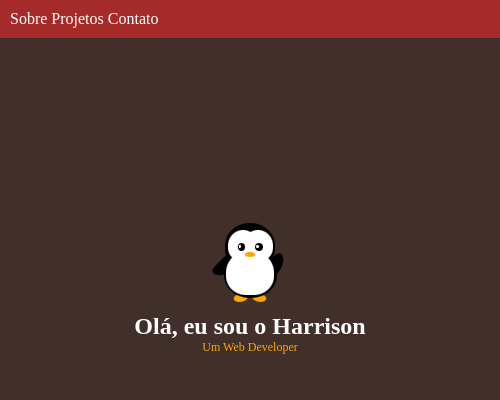

# Personal Portfolio

Este é um projeto proposto pela freeCodeCamp no curso de Responsive Web Design. Este projeto é uma web page para
apresentar os meus projetos.

     
    

# Tecnologias Utilizadas

- HTML
- CSS